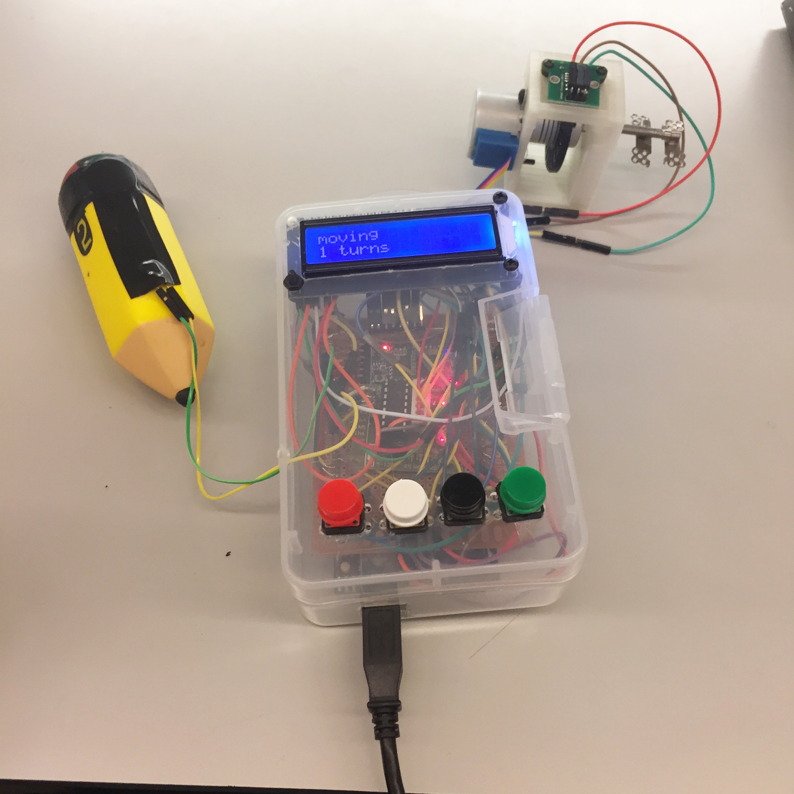

PROJECT NAME
============

**University of Pennsylvania, ESE 519: Real Time and Embedded Systems**

* Team Member: Placebo
* [Blog](https://devpost.com/software/project-name) (TODO: Link to devpost submission)

### VIDEO
[]https://www.youtube.com/watch?v=HlDqCCFK9PE

![]
Function explanations:
| Buttons | 
White button is for decreasing distractor distance.
Black button is for increasing distractor distance.
Green button is for committing distractor distance. 
Red button is for immediately shutting off motor moving.
| Pressure sensor |
Wrapping in upper left soft pencil. When force exerting on pressure sensor, motor rotation speed would decrease. Larger the force is, slower would the sWhen force is released, motor rotate at normalized speed.